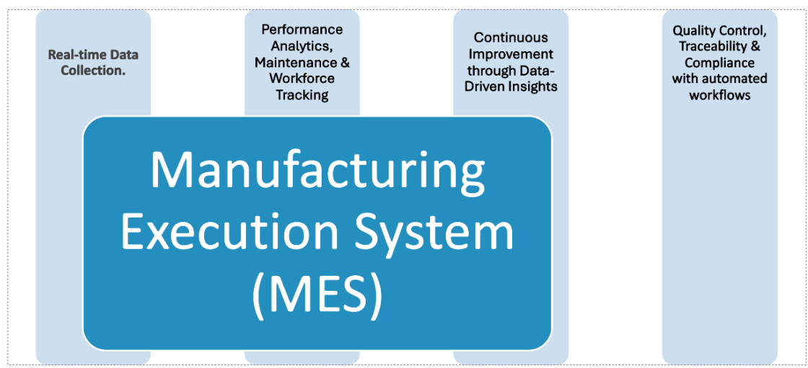

Welcome to the MES Help hub!
===================================

This documentation provides comprehensive guidance and step-by-step instructions on how to use the Manufacturing Execution System (**MES**) integrated with Infor <LN>. Whether you are an MES-Operator on the shop floor, a MES-Supervisorr, or a MES-Administrator, this guide is designed to help you understand and efficiently use the **MES** system in connection with <LN> ERP.

The MES-LN integration enables real-time visibility, data collection, and control across manufacturing operations, ensuring that production execution is aligned with enterprise-level production planning and production control. 

**MES** is controlled and managed by three roles. Make sure to read below *MES-Roles Definition** before proceeding with the next topics.

.. note::

   The **MES** application aligns with **ISA-95** principles, thus ensuring operations execution efficiency, instant traceability, optimized managerial **Shop Floor** decisions accross departments.

MES Capabilities Diagram
=========================

--------

.. toctree::

   usage
   naviagtion   
   features
   api
